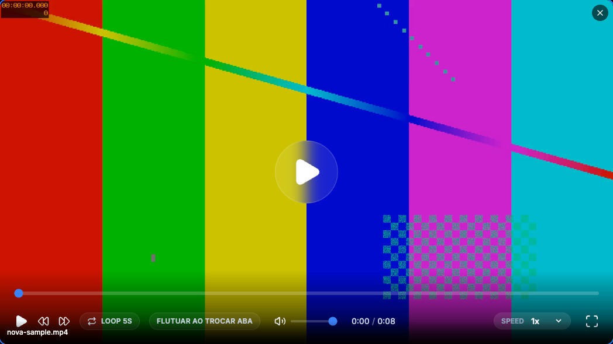
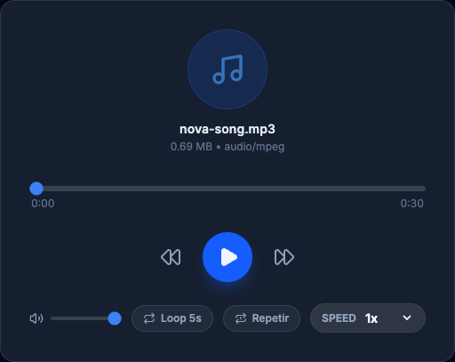

# NovaPlayer

Local video and audio player built with React + Vite to review media in the browser without uploading files to a server.

## Screenshots





## What the app does

- Imports local video and audio files by click or drag and drop.
- Plays video with custom controls and a timeline hover preview.
- Plays audio through a dedicated player.
- Repeats a single track with the full-track repeat toggle.
- Adjusts playback speed between `0.5x` and `4x`.
- Skips `5s` forward and backward.
- Loops the last `5s` to review short segments.
- Transcodes unsupported formats (`WMV`, `MPG`) to MP4 locally before playback.
- Supports fullscreen in the video player.
- Supports floating mode with `Picture-in-Picture` when switching tabs.
- Keeps files in the browser using `URL.createObjectURL`.

## Keyboard shortcuts

### Video

- `Space`: play / pause
- `Left Arrow`: skip back 5s
- `Right Arrow`: skip forward 5s
- `Up Arrow`: increase speed
- `Down Arrow`: decrease speed
- `R`: reset speed to `1x`
- `F`: enter or exit fullscreen
- `L`: toggle loop of the last `5s`
- `M`: mute or unmute

### Audio

- `Space`: play / pause
- `Left Arrow`: skip back 5s
- `Right Arrow`: skip forward 5s
- `Up Arrow`: increase speed
- `Down Arrow`: decrease speed
- `R`: reset speed to `1x`
- `L`: toggle loop of the last `5s`
- `M`: mute or unmute

## Stack

- `React 19`
- `TypeScript`
- `Vite`
- `Vitest`
- `Testing Library`
- `ESLint`
- `Prettier`
- `Husky` + `lint-staged`

## Requirements

- `Node.js`
- `npm`

## Running locally

```bash
npm install
npm run dev
```

Open the URL printed by Vite, usually `http://localhost:5173`.

## Scripts

```bash
npm run dev
npm run build
npm run preview
npm run lint
npm run format
npm run format:check
npm run test
```

## Tests and quality

The project includes:

- tests with `Vitest`
- lint with `ESLint`
- formatting with `Prettier`
- a pre-commit hook with `Husky` and `lint-staged`

## Privacy

Selected files are processed locally in the browser. The app does not upload media to a backend.

## Deploy

Build configuration for `Netlify` lives in [`netlify.toml`](./netlify.toml).
